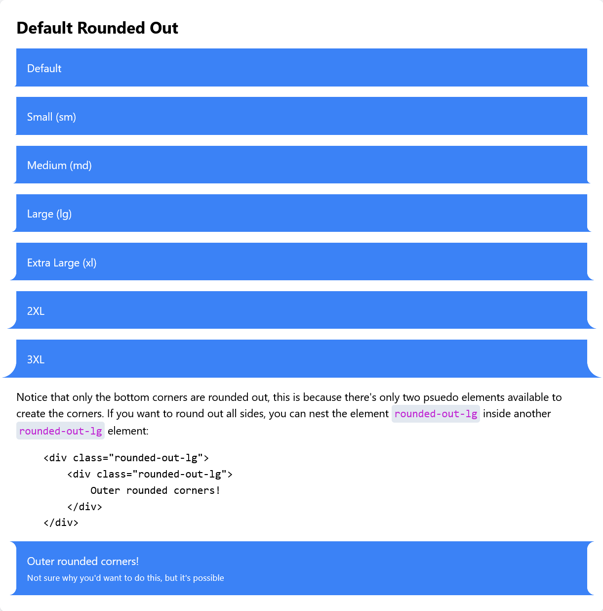
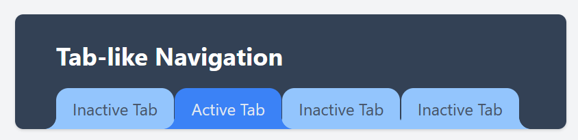
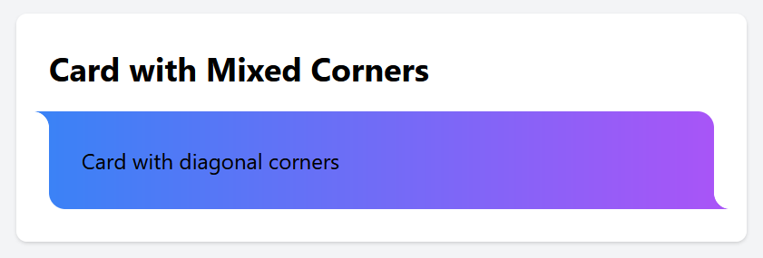
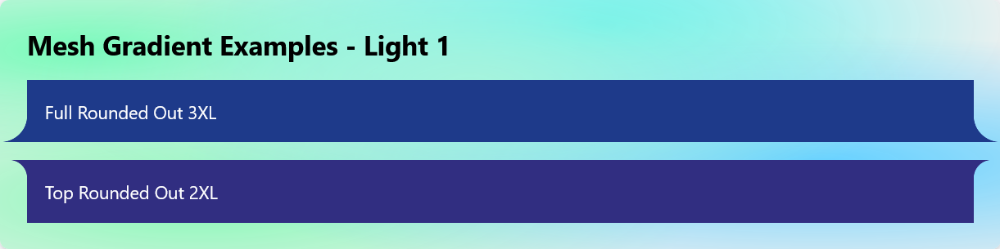
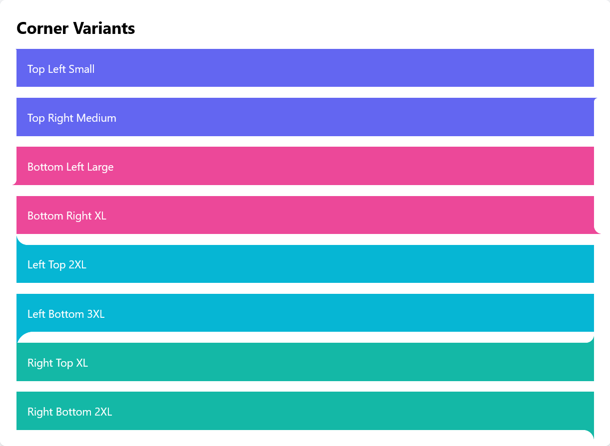

# Tailwind Rounded Out

A Tailwind CSS plugin that adds _**"outside" rounded corners**_ to elements 

<small>Similar to folder tabs or protruding cards. The plugin maintains background color/image inheritance while providing a wide range of customization options.</small>

<div align="center">
  
</div>

## Features

- Maintains background inheritance (colors, gradients, images)
- Supports all corners and sides independently
- Works with Tailwind's default radius sizes
- Supports arbitrary values
- Zero dependencies besides Tailwind CSS

## Installation

```bash
npm install tailwind-rounded-out
```

## Setup

Add the plugin to your `tailwind.config.js`:

```js
module.exports = {
  content: [
    // ...
  ],
  theme: {
    // Optionally customize default sizes
    roundedOut: {
      sm: "0.125rem",
      // ... other sizes
    },
  },
  plugins: [require("tailwind-rounded-out")],
};
```
<sub>note: if you don't supply custom sizes, the plugin will use the same values from either the `theme.borderRadius` or the default theme sizes</sub>

## Basic Usage

```html
<!-- All corners -->
<div class="rounded-out-lg">Basic card with large outer corners</div>

<!-- Specific sides -->
<div class="rounded-out-b-xl">Bottom corners only</div>

<!-- Individual corners -->
<div class="rounded-out-bl-2xl">Just bottom-left corner</div>

<!-- Mixed sizes -->
<div class="rounded-out-bl-xl rounded-out-br-sm">
  Different sizes for bottom-left and bottom-right
</div>

<!-- Arbitrary values -->
<div class="rounded-out-[25px]">Custom radius size</div>
```

## Available Classes

### Full Rounding

- `rounded-out-{size}`
  - Sizes: `sm`, `md`, `lg`, `xl`, `2xl`, `3xl`

### Directional Variants

- `rounded-out-{t|b|l|r}-{size}` - Top, Bottom, Left, Right
- `rounded-out-{tl|tr|bl|br}-{size}` - Top-Left, Top-Right, etc.
- `rounded-out-{lt|lb|rt|rb}-{size}` - Left-Top, Left-Bottom, etc.

### Arbitrary Values

- `rounded-out-[size]`
- `rounded-out-{direction}-[size]`

## How It Works

This plugin uses CSS `::before` and `::after` pseudo-elements to create the rounded corner effect with a CSS Mask, and so it can let the real background show through. The pseudo-elements are positioned absolutely and use CSS masks to create the rounded shape so there's no need for a fake background color.

### Important Notes

1. **Pseudo-element Usage**: Because this plugin uses `::before` and `::after` pseudo-elements, you cannot apply additional `::before` or `::after` styles to elements using these classes.

2. **Position Context**: Elements using these classes should have `position: relative` or any other position that creates a containing block.

3. **Background Inheritance**: The rounded corners will automatically inherit background colors, images, and gradients from the parent element.

## Examples

### Tab-like Navigation

```html
<nav class="flex gap-px text-slate-600">
  <a class="relative rounded-out-b-xl bg-blue-300 px-4 py-2 rounded-t-xl">
    Inactive Tab
  </a>
  <a
    class="relative rounded-out-b-xl bg-blue-500 px-4 py-2 rounded-t-xl z-10 text-slate-200"
  >
    Active Tab
  </a>
</nav>
```

#### Produces;


### Card with Mixed Corners

```html
<div
  class="relative rounded-out-tl-xl rounded-out-br-xl bg-gradient-to-r from-blue-500 to-purple-500 p-6 rounded-tr-xl rounded-bl-xl before:bg-blue-500 before:bg-none after:bg-purple-500 after:bg-none"
>
  Card with diagonal corners
</div>
```

#### Produces;


## Troubleshooting

### Common Issues

1. **Backgrounds Not Showing**

   - Ensure the parent element has a background color/image set
   - The element this is applied to needs to have `position: relative` or any other position that creates a containing block

2. **Conflicts with Other Styles**

   - Remove any ::before or ::after pseudo-elements on the same element
   - Check z-index values if elements appear in wrong order

3. **Overflow notes**
   - The corners are _outside_ of the bounding box
   - Setting an overflow hidden will prevent the pseudo-elements from showing

## License

MIT License - See [LICENSE](LICENSE) file for details


## More Examples

#### Backgrounds are able to show through, no fake backgrounds.


#### A range of corner variations

